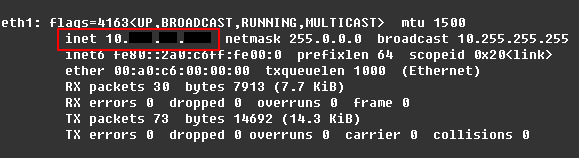
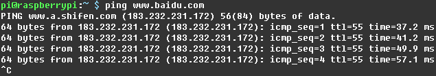

# 树莓派3B 4G WIFI热点搭建记录

使用树莓派3B自带WIFI+4G上网卡搭建4G WIFI热点成功，下面记录搭建过程及注意事项。
分两大部分，4G上网卡拔号和WIFI热点搭建，下面分别介绍。

## 4G上网卡拔号
为了使用移动4G卡上网，此处使用了中兴MF832S 4G上网卡，树莓派3B上安装的Debian操作系统(版本代号Stretch）支持该网卡，无需安装USB\_ModeSwitch进行模式切换，我们只需要在上网时执行以下拔号脚本即可：
```python
#!/usr/bin/python3
from time import sleep
import serial
import sys

def send_cmd(cmd):
    cur_cmd = cmd + '\r\n'
    modem.write(cur_cmd.encode())
    #modem.flush()

def recv_cmd():
    recv_echo = modem.readline().decode()
    if recv_echo != '':
        if recv_echo == '\r\n':
            #print('Receive echo is: CR+LF')
            return '\r\n'
        else:
            recv_echo = recv_echo.strip()
            print('Receive echo is: '+recv_echo+'\n')
            return recv_echo
    else:
        print('Error, no response!\n')


#init 4g modem serail port
modem = serial.Serial("/dev/ttyUSB1",timeout=0.5,baudrate=115200,rtscts=True,dsrdtr=True)

#if AT cmd no response,then exit script.
send_cmd('AT')
sleep(0.1)
recv_cmd()
if recv_cmd() != 'OK':
    sys.exit(0)

send_cmd('AT+CFUN=1')
sleep(6)
while(1):
    if recv_cmd() == '+ZPBIC: 1,1':
        break

send_cmd('AT+CEREG=1')
sleep(0.1)
recv_cmd()
recv_cmd()

send_cmd('AT+CGREG?')
sleep(0.1)
for i in range(4):
    recv_cmd()

send_cmd('AT+CEREG?')
sleep(0.1)
for i in range(4):
    recv_cmd()

send_cmd('AT+ZGACT=1,1')
sleep(0.1)
for i in range(4):
    recv_cmd()
```

注意以上脚本为python脚本，需要以下方式启动：
```bash
#!/bin/bash
source /home/pi/python35/bin/activate
python /home/pi/4g_dial.py
```

拔号后使用ifconfig命令查看eth1端口状态，如果有inet 10.XX.XX.XX的IP地址出现，则拔号成功，再用ping命令测试外网能否ping通。



## WIFI热点搭建
WIFI热点搭建只需要配置好hostapd即可，但我想让树莓派同时支持有线和无线两种方式上网，因此需要将自带的有线网卡(eth0)和无线网卡(eth1)组成一个网桥，然后再使用dnsmasq作为DHCP服务器分配IP地址。

1. 热点搭建涉及以下软件，需要提前安装好：
```bash
sudo apt-get install dnsmasq hostapd bridge-utils
```

1. 添加网桥：
```bash
sudo brctl addbr br-lan
sudo brctl addif br-lan eth0
```

1. 因为Stretch默认使用dhcpcd.conf配置网络，但hostapd只识别/etc/network/interfaces中的网络配置，因此需要修改dhcpd.conf，禁止对wlan0/eth0/eth1进行配置：
```bash
sudo vi /etc/dhcpcd.conf
```
添加以下三行，记得添加到文件首行：
```bash
# Don't config wlan0/eth0/eth1 in dhcpcd.conf
denyinterfaces wlan0
denyinterfaces eth0
denyinterfaces eth1
```

1. 对/etc/network/interfaces进行配置：
```bash
sudo vi /etc/network/interfaces
```
配置eth1接口采用DHCP自动获取IP地址，
配置网桥包含eth0和wlan0，固定IP地址为192.168.0.1：
```bash
#eth1
auto eth1
allow-hotplug eth1
iface eth1 inet dhcp
#Bridge setup
auto br-lan
iface br-lan inet static
bridge_ports eth0 wlan0
address 192.168.0.1
netmask 255.255.255.0
```

1. 新增/etc/hostapd/hostapd.conf配置，内容如下：
```bash
sudo vi /etc/hostapd/hostapd.conf
```
```bash
# This is the name of the WiFi interface we configured above
interface=wlan0
### Set your bridge name ###
bridge=br-lan
# Use the nl80211 driver with the brcmfmac driver
driver=nl80211
# This is the name of the network
ssid=Pi
# Use the 2.4GHz band
hw_mode=g
# Use channel 1
channel=1
# Enable 802.11n
ieee80211n=1
# Enable WMM
wmm_enabled=1
# Enable 40MHz channels with 20ns guard interval
ht_capab=[HT40][SHORT-GI-20][DSSS_CCK-40]
# Accept all MAC addresses
macaddr_acl=1
# Use WPA authentication
auth_algs=1
# Require clients to know the network name
ignore_broadcast_ssid=0
# Use WPA2
wpa=2
# Use a pre-shared key
wpa_key_mgmt=WPA-PSK
# The network passphrase
wpa_passphrase=youpassword
# Use AES, instead of TKIP
rsn_pairwise=CCMP
```

1. 修改/etc/default/hostapd，指定配置文件：
```bash
sudo vi /etc/default/hostapd
```
```bash
DAEMON_CONF="/etc/hostapd/hostapd.conf"
```

1. 修改/etc/dnsmasq.conf，指定需要DHCP服务的网络接口、分配的IP地址范围和更新时间：
```bash
sudo mv /etc/dnsmasq.conf /etc/dnsmasq.conf.orig
sudo vi /etc/dnsmasq.conf
```
```bash
interface=br-lan
listen-address=192.168.0.1
bind-interfaces
domain-needed
bogus-priv
dhcp-range=192.168.0.100,192.168.0.200,255.255.255.0,24h
```

1. 修改/etc/sysctl.conf，允许IP转发：
```bash
sudo vi /etc/sysctl.conf
```
添加以下配置：
```bash
net.ipv4.ip_forward=1
```

1. 添加防火墙配置，将发往eth1的数据进行NAT转换：
```bash
sudo iptables -t nat -A  POSTROUTING -o eth1 -j MASQUERADE
sudo sh -c "iptables-save > /etc/iptables.ipv4.nat"
```
修改/etc/rc.local添加以下配置，在开机时自动配置NAT：
```bash
sudo vi /etc/rc.local
```
```bash
iptables-restore < /etc/iptables.ipv4.nat
```